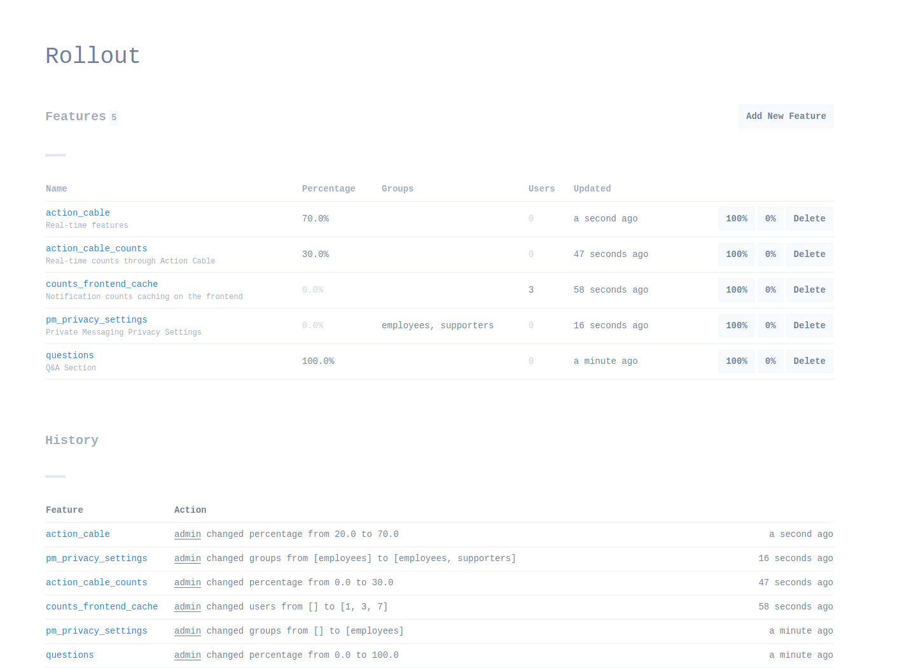
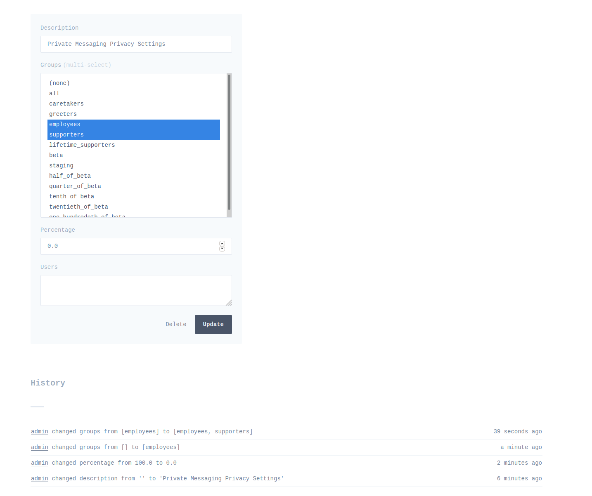

# Rollout::UI

Minimalist UI for the [rollout](https://github.com/fetlife/rollout) gem that
you can just mount as a Rack app and it will just work.


<!--  -->

## Usage with Rails


Add it to your application's Gemfile:

```ruby
gem 'rollout-ui'
```

Mount it

```ruby
Rails.application.routes.draw do
  mount Rollout::UI::Web.new => '/admin/rollout'

  # ...
end
```

And to configure it with your `Rollout` instance, you can put your configuration
in `routes.rb` or in a standalone initializer.

```ruby
Rollout::UI.configure do
  instance { $rollout }
end
```

## Authentication

If you are using Rails, you can put `constraints` on your mount.

So in case of usafe with Devise, your constraints might look like:

```ruby
module Constraint::Admin
  def self.matches?(request)
    id = request.session["warden.user.user.key"].try(:[], 0).try(:[], 0)
    return false if id.blank?

    user = User.find_by(id: id)
    user&.admin?
  end
end

Rails.application.routes.draw do
  mount Rollout::UI::Web.new => '/admin/rollout', constraints: Constraints::Admin

  # ...
end
```

## API Endpoints

The index and show routes can also respond with JSON data instead of HTML when the request's `Accept` header is
`application/json`

The index route also accepts query parameters to filter by user or group:
`/admin/rollout?user=someone`
`/admin/rollout?group=developers`

## Logging

To get the most out of **rollout-ui**, we recommend you to turn on logging
on your rollout instance to see history of changes in the UI.

```ruby
$rollout = Rollout.new(Redis.current, logging: { history_length: 100, global: true })
```

To also see who updated states of your rollouts, you can configure `actor` and
`actor_url`. So if you are using Rails with Devise, your configuration might
look like:

```ruby
Rollout::UI.configure do
  instance { $rollout }
  actor { current_user&.username }
  actor_url { |actor| "/#{actor}" }
end
```

## Contributing

Bug reports and pull requests are welcome on GitHub at https://github.com/fetlife/rollout-ui.

To run this project for development in isolation:

```sh
bundle install
bundle exec rerun rackup
```

And visit [http://localhost:9292/](http://localhost:9292/).

Alternatively you can also configure which Redis with:

```sh
REDIS_HOST=localhost REDIS_PORT=6379 REDIS_DB=10 be rerun rackup
```

## License

The gem is available as open source under the terms of the [MIT License](https://opensource.org/licenses/MIT).
