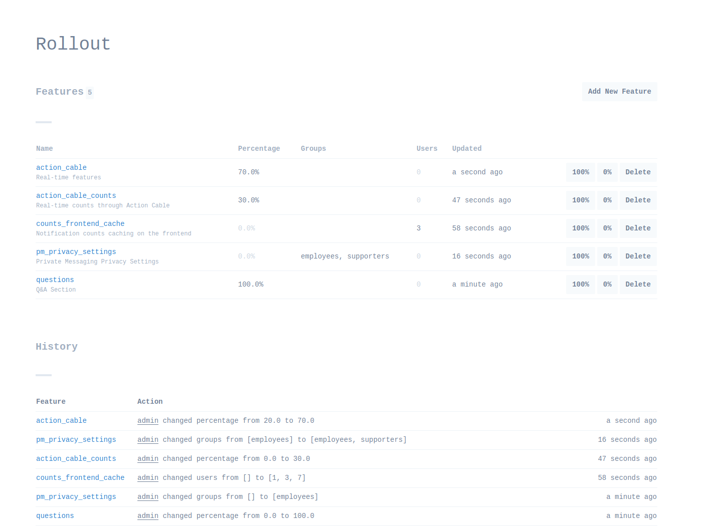
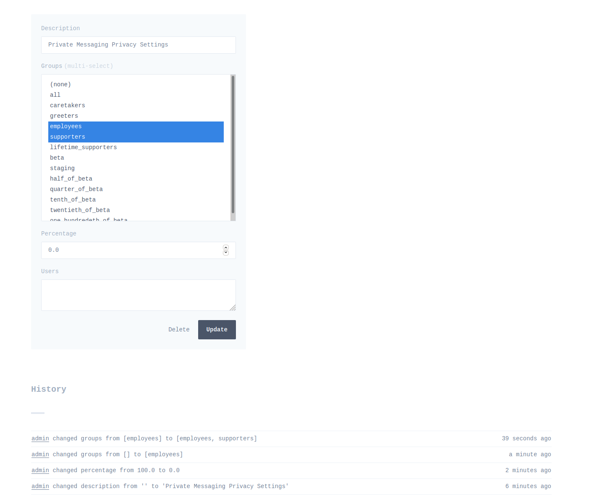

# Rollout::UI

Minimalist UI for the [rollout](https://github.com/fetlife/rollout) gem that
you can just mount as a Rack app and it will just work.


<!--  -->

## Usage with Rails


Add it to your application's Gemfile:

```ruby
gem "rollout", "~> 3.1"
gem "rollout-redis-adapter", "~> 0.1"
gem "rollout-ui"
```

`rollout-ui` 0.9+ requires Rollout 3.1 and does not support Rollout 2.x. The UI is backend-neutral: applications using Redis should add `rollout-redis-adapter` and pass a configured Rollout instance into the UI.

Mount it

```ruby
Rails.application.routes.draw do
  mount Rollout::UI::Web.new => '/admin/rollout'

  # ...
end
```

And to configure it with your `Rollout` instance, you can put your configuration
in `routes.rb` or in a standalone initializer.

```ruby
Rollout::UI.configure do
  instance { $rollout }
end
```

## Authentication

If you are using Rails, you can put `constraints` on your mount.

So in case of usafe with Devise, your constraints might look like:

```ruby
module Constraint::Admin
  def self.matches?(request)
    id = request.session["warden.user.user.key"].try(:[], 0).try(:[], 0)
    return false if id.blank?

    user = User.find_by(id: id)
    user&.admin?
  end
end

Rails.application.routes.draw do
  mount Rollout::UI::Web.new => '/admin/rollout', constraints: Constraints::Admin

  # ...
end
```

## Browser JSON routes

The index and show routes can also respond with JSON data instead of HTML when the request's `Accept` header is
`application/json`

The index route also accepts query parameters to filter by user or group:
`/admin/rollout?user=someone`
`/admin/rollout?group=developers`

## Read-only CLI and API v1 (0.10.0, unreleased)

This repository also owns the independently installable [rollout-cli](rollout-cli/README.md)
gem. Installing it does not install Sinatra, Rails, core Rollout, or adapters.
The browser JSON routes above retain their existing shape; they are not API v1.

The API is a separate Rack application, loaded and mounted only when the host opts
in. It requires Rollout 3.1; no core version bump is needed. Configure a fixed
server environment and wrap the API with **host-owned bearer authentication and
read authorization** before mounting it:

```ruby
require "rollout/ui/api"

api = Rollout::UI::API.new(instance: $rollout, environment: Rails.env.to_s)
# HostRolloutReadAuthorization is a placeholder for your application's middleware.
authorized_api = HostRolloutReadAuthorization.new(api)
Rails.application.routes.draw do
  mount authorized_api => "/internal/rollout/v1"
end
```

Do not mount the bare API publicly. The host must issue/validate/revoke credentials,
authorize access to targeting users and event context, and return JSON 401/403
instead of browser login redirects. Browser cookies do not authenticate this API.
The API mounts no browser routes and accepts GET only.

API v1 serves `/features`, `/features/{name}`, `/features/{name}/history`, and
`/history`. It validates query parameters, limits results to 1–1000 records, caps
serialized output at 1 MiB, and sends `Cache-Control: no-store`. History retention
is independently count-bounded per feature and globally. Completeness is always
unknown; deletion clears feature history and emits no deletion event.

See the [HTTP contract](rollout-cli/HTTP_API.md) for encoding, errors and retention
semantics, and the [integration checklist](docs/rollout-cli-integration.md) for tests
and outstanding host changes. Release a new rollout-ui version before upgrading
the host: published 0.9.2 does not provide this API. Production is unverified.

## Logging

To get the most out of **rollout-ui**, we recommend you to turn on logging
on your rollout instance to see history of changes in the UI.

```ruby
require "redis"
require "rollout"
require "rollout/adapters/redis"

$redis = Redis.new
$rollout = Rollout.new(
  adapter: Rollout::Adapters::Redis.new($redis),
  logging: { history_length: 100, global: true },
)
```

To also see who updated states of your rollouts, you can configure `actor` and
`actor_url`. So if you are using Rails with Devise, your configuration might
look like:

```ruby
Rollout::UI.configure do
  instance { $rollout }
  actor { current_user&.username }
  actor_url { |actor| "/#{actor}" }
end
```

## Contributing

Bug reports and pull requests are welcome on GitHub at https://github.com/fetlife/rollout-ui.

### Development Setup

This project uses [mise](https://mise.jdx.dev/) for managing development tools.

Install mise if you haven't already:

```sh
curl https://mise.run | sh
```

Then install the required tools and dependencies:

```sh
mise install
bundle install
```

To run this project for development in isolation:

```sh
bundle exec rerun rackup
```

And visit [http://localhost:9292/](http://localhost:9292/).

Alternatively, you can also configure which Redis with:

```sh
REDIS_HOST=localhost REDIS_PORT=6379 REDIS_DB=10 bundle exec rerun rackup
```

### Releasing

1. Bump version: `rake version:patch` (or `minor`/`major`)
2. Commit and tag: `git commit -am "Bump version" && git tag v0.7.3`
3. Push: `git push origin master --tags`

The GitHub Actions workflow will automatically publish to RubyGems when tags are pushed.

## License

The gem is available as open source under the terms of the [MIT License](https://opensource.org/licenses/MIT).
